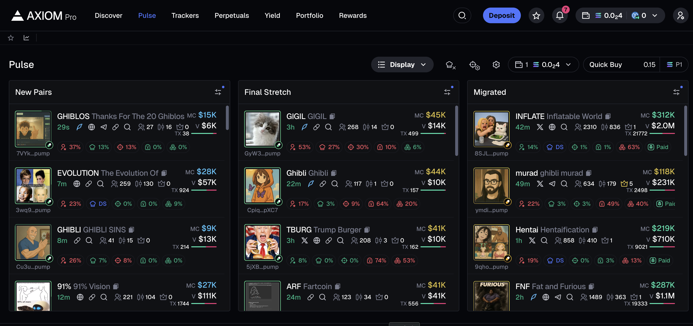
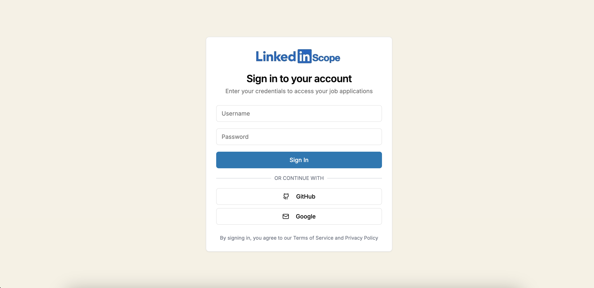
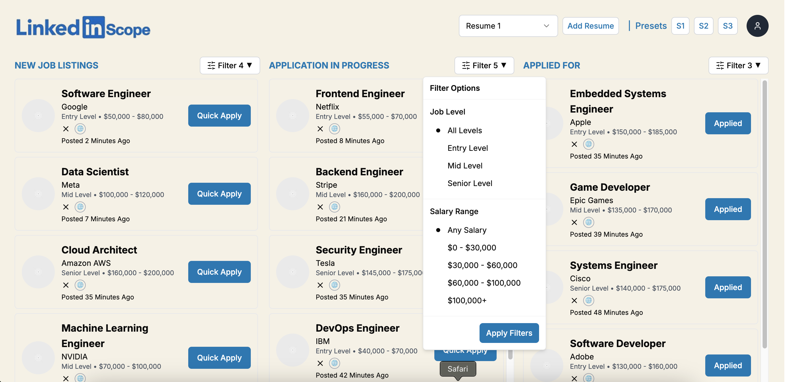

# LinkedIn-Scope

**Live Demo:** [https://linkendin-scope.vercel.app/login](https://linkendin-scope.vercel.app/login)

Inspired by Photon/Axiom Memescope, this project presents a LinkedIn-style user interface tailored for job searching. Below are examples of the basic UI and authentication pages.

## Mock Authentication Credentials

- **Username:** paritosh
- **Password:** paritosh

## Screenshots

**Axiom UI of Memescope**

**Authentication Page**

**Landing Page**

